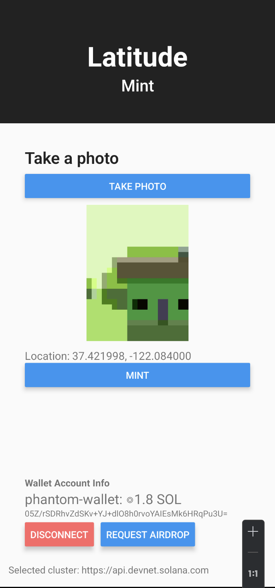

# Latitude Mint
Assignmet for module 7 of Solana Summer Internship 2024
```
Build an app that captures an image through the camera, mints an NFT with that image, and adds the current location longitude, latitude in the metadata.
```


## Tech stack
- React Native
- Solana Web3.js
- @solana-mobile/mobile-wallet-adapter-protocol
- react-native-image-picker
- @react-native-community/geolocation



## Steps to run the project
1. Install yarn if you don't have it already
```sh
npm install -g yarn
```
2. Install dependencies
```sh
yarn install
```
3. Run metaplex fixer
```
node metaplex-fixer.mjs
```
4. Run the app
```sh
npx react-native run-android
```
